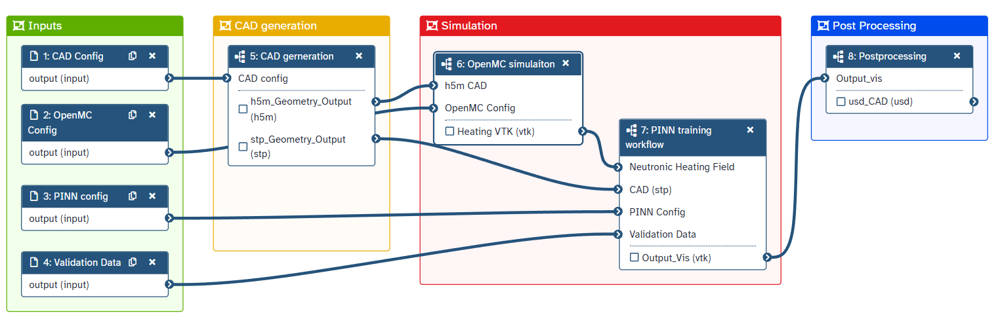

### **Workflows**: a user perspective
### Oliver Woolland (RSE, 2025)

---

# What is a workflow?

---
### My answer ~2022:

#### **Formalised chains of software tools, explicitly defining the flow of data between them.**

- **Abstract**: logic separate to data, remix / compose
- **Automated**: reusable, reproducible, provenance
- **Scalable and portable**: local / HPC, Windows / Linux
- **Shareable and citable**: publishable, create DOIs

---

# So formal!

All of these points are true and valid

But...

I was missing the point a bit

---

## What is a workflow *for a user?

Workflows are really about:
- **Enabling research** not installing tools 
- **Doing research** not manually running tools
- **Accelerating research** using HPC / cloud
- **Sharing research** not just reports and papers

---




---

## So what changed?

I became familiar with Galaxy!

(and spent more time with researchers)

--- 

## Why Galaxy changed my mind?

- Server based - users only need a browser!
- All of the tool config / faff is pushed to sysadmins
- Nice GUI, no code for users
- Already widely adopted 
- Sharing / reuse / remix architecture already exists

--- 

## But my workflow engine is better?

Well, maybe. But you have to pick one.

List of 361 workflow engines:
https://github.com/common-workflow-language/common-workflow-language/wiki/Existing-Workflow-systems

---

## Why Galaxy is good enough

- No need to user to install any runtime
- No need for user to install science tools
- Can interfce with HPC
- Has an API
- Is actively mantained 

---

# **Can I prove it?**

### I think so! 
Let's look at a worked example

---

# Introducing: some linguists

- **Alice** (Masters student) saw a tool online
- **Bob** (PhD student) knows a tool from the literature
- **Charlie** (Postdoc) too busy but has big ideas
- **Dani** (PI) wants research to occur, to show off
- **Me** (pretending to be a sysadmin)

#### Their research aim: 
**To mine data from a database of phrases**

---

## Demo

### Time for chaos

--- 

What did we see?

Researchers doing research! Without any setup
Using tools, making workflows, sharing output

---

How would this look for an RSE?

Galaxy can be hosted locally (clone this repo for a demo)
Develop some new tools
Push them to a central instance?

---

Let's have a look at a tool

```xml
<tool id="letter_count" name="Letter Count" version="0.1.0">
  <description>Counting letters in a string</description>
  
  <requirements>
    <container type="docker">python:3.13-slim</container>
  </requirements>
  
  <command>
    <![CDATA[
      python '$__tool_directory__/letter_count.py' '$input_str' '$output_file'
    ]]>
  </command>

  <inputs>
    <param type="text" name="input_str" label="Input String" help="Enter the string to count the letters" />
  </inputs>

  <outputs>
    <data format="txt" name="output_file" label="Letter Count" help="Output file containing the letter count" />
  </outputs>
  
  <help>
    This tool counts the number of letter in each word of a string.
  </help>

</tool>
```

---

## What happens when my project ends?

---

## What happens when my project ends?


In my experience, all workflow projects die at the end of the project (sooner or later).

- Personally: a trail of dead Galaxies, some CWL memorial stones
- Others: unused workflow files, decaying tooling

---

## My suggestion

We begin to trail a persistant, central Galaxy instance for RSEs.

We get a workstation scale system and put it under a desk.

RSEs doing workflow projects see if Galaxy fits their needs, contribute tools and workflow.


---

## My suggestion


We begin to trail a persistant, central Galaxy instance for RSEs.

We get a workstation scale system and put it under a desk.

RSEs doing workflow projects see if Galaxy fits their needs, contribute tools and workflow.

--- 

## The future

If the instance is popular and meets a need:
- Good problem to have

If it is not:
- Nice workstation for someone

Any questions?
